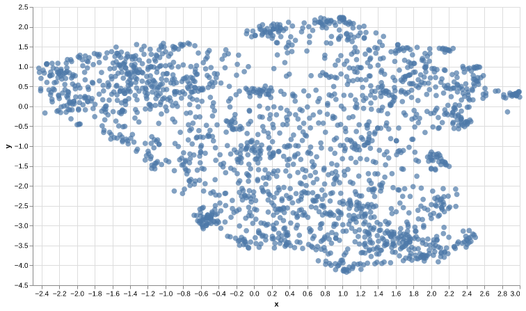

# Embeddings

## Notebook

- [Jupyter Notebook](../code/L2-Embeddings.ipynb)
  - Wikipedia embeddings plot in two dimensions
    - 
      - For interactive mode, download [Wiki chart html page](../code/output/wiki_chart.html) and open it in browser. Text will be shown on mouse over the points.
      - Refer [altair-viz thread](https://github.com/altair-viz/altair_saver/issues/82#issuecomment-735025813) for details.

- `wikipedia.pkl` contains embedding of 1st paragraph of Wikipedia articles.
- Libraries utilized:
  - [UMAP: Unified Manifold Approximation and Projection for Dimension Reduction](https://umap-learn.readthedocs.io/en/latest/)
  - [PyNNDescent for fast Approximate Nearest Neighbors](https://pynndescent.readthedocs.io/)
